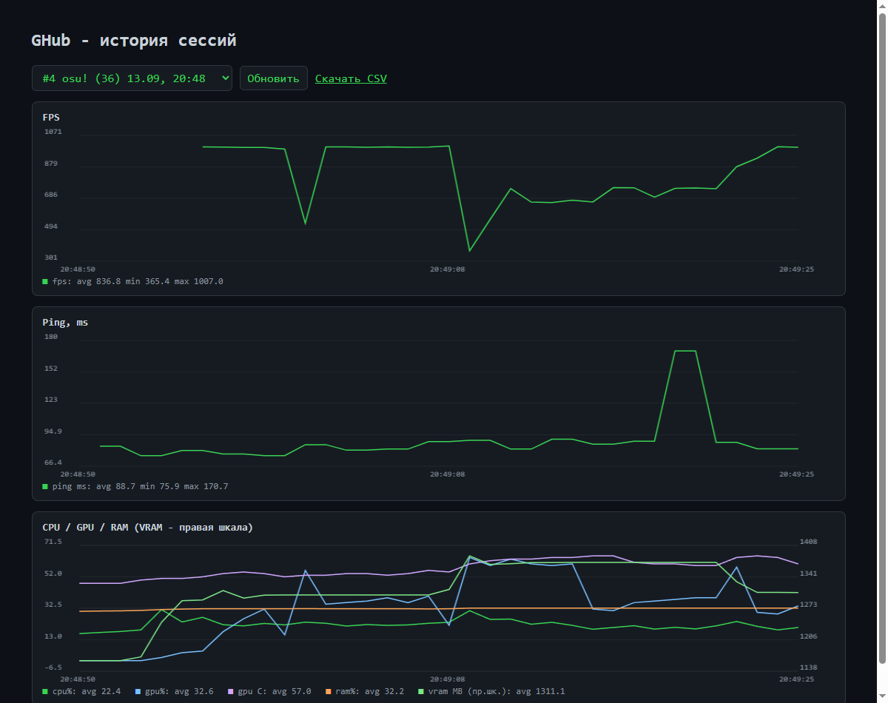

# ⚡ GHub — Gaming Performance Hub & Optimizer

<p align="center">
  <b>Игровой хаб нового поколения для Windows:</b><br>
  чистый оверлей без инжекта, мониторинг FPS / Frame Time / Ping / CPU / GPU / RAM,<br>
  веб-дашборд с интерактивными графиками, оптимизатор процессов и аналитика в SQLite.
</p>

<p align="center">
  <a href="https://github.com/Metsubou9/GHub/releases/latest"></a>
  <a href="https://github.com/Metsubou9/GHub/releases"></a>
  <a href="LICENSE"></a>
  
  
  
  
</p>

---

> 🚀 **[Скачать готовую Portable-сборку (v0.16)](https://github.com/Metsubou9/GHub/releases/download/v0.16/GHub-v0.16-portable.zip)**  
> Автономная версия без необходимости устанавливать Python. Распакуйте архив в удобную папку и запустите `GHub.exe` от имени администратора.

---

## 📸 Интерфейс и Дашборд

### Интерактивный веб-дашборд аналитики сессий (`http://127.0.0.1:8765`)
> Полнофункциональный локальный веб-интерфейс на HTML5 Canvas без внешних веб-зависимостей: история всех игровых сессий, интерактивные графики FPS, задержки кадра (Frame Time ms), сетевого пинга, температуры и загрузки CPU/GPU/VRAM, а также экспорт в CSV в 1 клик.



---

## 🌟 Ключевые возможности

- 🎮 **Безопасный оверлей (Zero-Injection)**:
  - Отображение поверх игр актуального FPS, Frame Time, пинга, загрузки и температур CPU/GPU.
  - Работает через PresentMon v2 и ETW без инжекта в память игры — **100% безопасно для Easy Anti-Cheat, BattlEye и VAC**.
  - Поддержка перемещения оверлея мышью (drag & drop) и горячее скрытие/показ.

- 🌐 **Интеллектуальный поиск IP сервера катки (Smart Match Ping)**:
  - Автоматическое определение IP-адреса игрового сервера матча по сетевым UDP-соединениям процесса (актуально для Dota 2, Deadlock, CS2).
  - Фоновый пинг игрового сервера в реальном времени с расчетом процента потери пакетов (Packet Loss %).
  - Резервные fallback-хосты при нахождении в лобби.

- ⚙️ **Оптимизатор процессов и игровых профилей**:
  - Автоматическое и ручное применение профилей оптимизации (`default`, `performance`, `aggressive`) из `config/optimizer.yaml`.
  - Управление приоритетом процесса (`high`, `realtime`), маской ядер процессора (CPU Affinity) и завершение фоновых фоновых программ (`kill_junk`).
  - Быстрое переключение профилей через контекстное меню трея с индикатором активного режима.

- 📊 **Локальная база данных SQLite и экспорт**:
  - Полная телеметрия каждой игровой сессии сохраняется локально в SQLite.
  - Автоматическая миграция схемы базы данных.
  - Мгновенный экспорт сессии в `.csv` для детального анализа в Excel или Python.

- 🛡️ **Отказоустойчивый режим (Degraded Mode)**:
  - При запуске без прав администратора или без внешних бинарников хаб не падает, а корректно отображает `--` для недоступных аппаратных сенсоров.

---

## 🚀 Установка и запуск

### Для пользователей (Portable ZIP)
1. Скачайте архив **`GHub-v0.16-portable.zip`** со страницы [Releases](https://github.com/Metsubou9/GHub/releases).
2. Распакуйте в любую папку пользователя (например, `D:\Tools\GHub\`).  
   *(Не распаковывайте в `Program Files`, чтобы Windows не блокировала запись локальной базы данных).*
3. Запустите **`GHub.exe` от имени администратора** (необходимо для чтения ETW метрик PresentMon и сенсоров температуры).
4. Откройте дашборд в браузере: [`http://127.0.0.1:8765`](http://127.0.0.1:8765).

---

### Для разработчиков

```powershell
# 1. Клонирование репозитория
git clone https://github.com/Metsubou9/GHub.git
cd GHub

# 2. Установка зависимостей Python
pip install -r requirements.txt

# 3. Запуск тестов
python -m unittest discover -s tests

# 4. Запуск хаба
python main.py
```

---

## 📦 Внешние компоненты

| Компонент | Расположение | Назначение |
|---|---|---|
| `presentmon.exe` | корень проекта | Захват FPS и задержки кадра через ETW без инжекта ([PresentMon](https://github.com/GameTechDev/PresentMon)) |
| `tools/cputemp.exe` | `tools/` | Чтение температуры ядер CPU через LibreHardwareMonitor (сборка: `tools/build_cputemp.ps1`) |

---

## 🛠️ Сборка исполняемого файла

Сборка автономного дистрибутива производится с помощью PyInstaller:

```powershell
# Сборка GHub.exe
powershell -ExecutionPolicy Bypass -File build_exe.ps1

# Сборка готового релизного Portable ZIP со всеми бинарниками
powershell -ExecutionPolicy Bypass -File build_release.ps1
```

---

## 📁 Структура проекта

```
GHub/
├── main.py                  # Точка входа, трей, оверлей, связка мониторинга
├── core/
│   ├── config_loader.py     # Загрузка и сохранение YAML-конфигов (games, optimizer)
│   ├── game_detector.py     # Детекция активного игрового процесса
│   ├── storage.py           # SQLite хранилище сессий и сэмплов
│   └── collector_abstract.py# Абстрактные интерфейсы метрик
├── modules/
│   ├── monitoring/          # Сборщики метрик (Windows, PresentMon FPS, Ping)
│   ├── optimizer/           # Применение приоритетов и CPU affinity
│   └── input_tester/        # Тестирование частоты опроса инпута
├── dashboard/
│   ├── server.py            # Встроенный HTTP сервер дашборда (stdlib)
│   └── dashboard.html       # Интерактивные Canvas-графики
├── ui/
│   ├── overlay.py           # Безрамочный Topmost оверлей (Tkinter)
│   ├── tray.py              # Иконка системного трея (Pystray)
│   └── input_window.py      # Окно проверки задержки ввода
└── tests/
    └── test_ghub.py         # Модульные тесты конфигураций, детектора и БД
```

---

## 🗺️ Roadmap развития

- [x] Интерактивные графики FPS, задержки кадра, пинга и температур в дашборде
- [x] Экспорт сырых данных сессии в CSV
- [x] Полноценный набор модульных тестов (`tests/test_ghub.py`)
- [x] Потокобезопасные системные уведомления и индикация активного профиля в трее
- [ ] Метрики AMD GPU (температура и загрузка через LibreHardwareMonitor)
- [ ] Автоматическая проверка обновлений релизов через GitHub API
- [ ] Расширение списка предустановленных игр в `config/games.yaml`

---

## 📄 Лицензия

Исходный код проекта распространяется под лицензией **MIT** (см. [LICENSE](LICENSE)).  
Сторонние компоненты (PresentMon, LibreHardwareMonitor) используются согласно их лицензиям (см. [THIRDPARTY_NOTICES.md](THIRDPARTY_NOTICES.md)).
